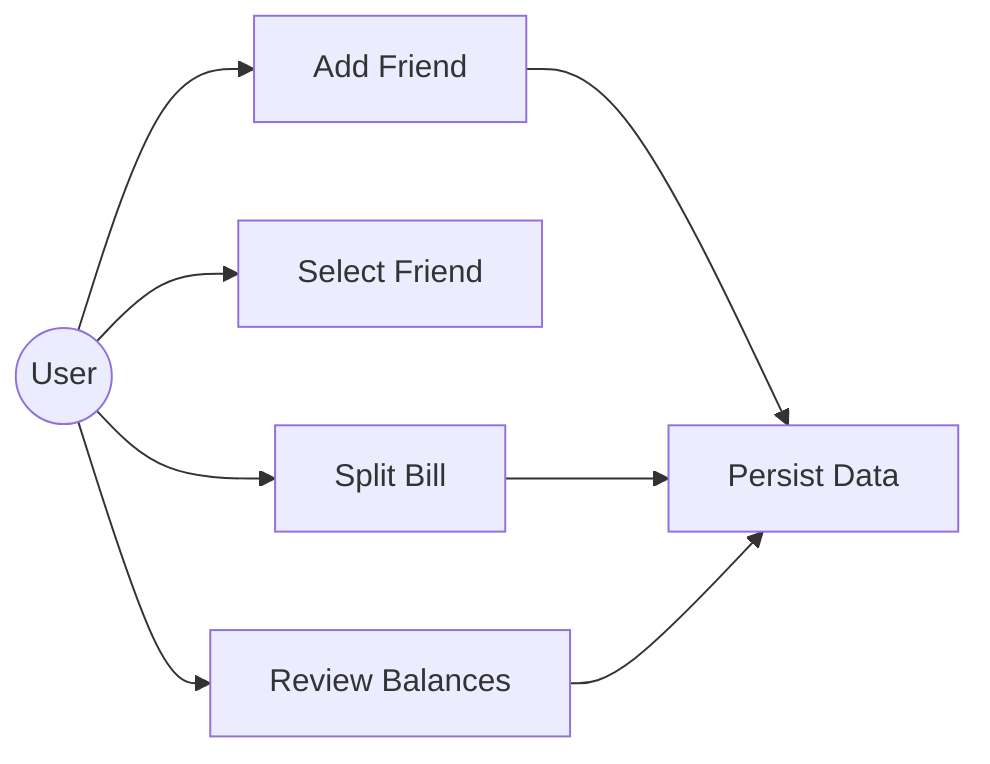
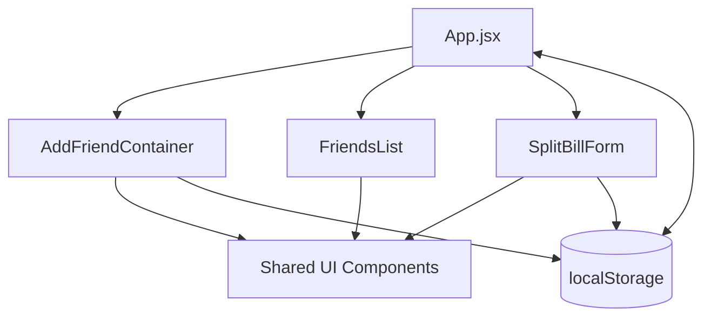
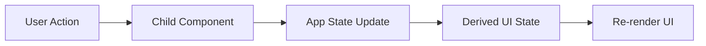
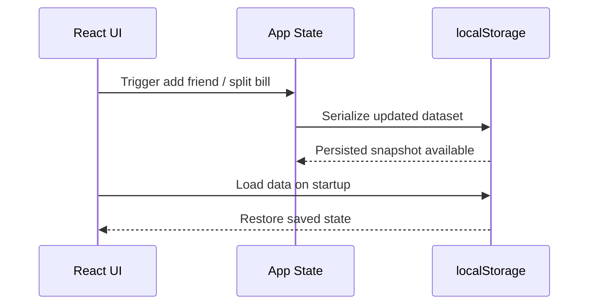

# Program Flow

This document describes the functional flow, architecture boundaries, and persistence behavior of PayShare. It is written for technical review and stakeholder presentation.

---

## System Overview

PayShare is a client-side expense-sharing application built with React and Vite. The application enables users to manage friends, split shared expenses, and track balances with persistent browser storage.

The core runtime model is:

- React manages UI rendering and state transitions.
- Local storage persists user data between sessions.
- Form interactions drive state changes and balance recalculation.
- Shared components keep the UI consistent and maintainable.

---

## Application Startup

1. The React application bootstraps from `main.jsx`.
2. Stored friend data is read from `localStorage` during initialization.
3. The application hydrates its in-memory state from the persisted data.
4. The initial friend list and default UI state are rendered.

### Outcome

The user lands on a fully initialized interface with previously saved balances and friend records restored.

---

## Adding a Friend

1. The user opens the Add Friend form.
2. The form validates required fields before submission.
3. A new friend record is created with a unique identifier and default balance.
4. Application state is updated immediately.
5. The updated friend list is synchronized to `localStorage`.

### Outcome

The new friend becomes available in the list without requiring a page refresh.

---

## Splitting a Bill

1. The user selects a friend from the list.
2. The bill amount, payer, and individual share values are entered.
3. The application validates the inputs and calculates the split.
4. The resulting debt delta is applied to the selected friend.
5. Updated balances are written to application state and persisted automatically.

### Outcome

The balance between the user and the selected friend is updated in real time and preserved for future sessions.

---

## State Persistence

1. Any meaningful state change triggers a persistence update.
2. The current friend dataset is serialized to `localStorage`.
3. On refresh or relaunch, the application restores the last saved state.

### Outcome

Users experience continuity across sessions without relying on a backend service.

---

## Use Case Diagram

The use case view represents the primary user goals supported by the system:

- Add a new friend.
- Select a friend for settlement.
- Split a bill.
- Review current balances.
- Persist and restore user data.

This diagram is useful for presenting the application scope to stakeholders and for validating feature completeness.

---

## Component Diagram

The component view documents how the UI is structured across reusable React modules:

- `App` orchestrates global state and event flow.
- `AddFriendContainer` manages friend creation.
- `FriendsList` renders users and selection state.
- `SplitBillForm` handles settlement calculations.
- Shared UI utilities provide consistent controls and icons.

This diagram is useful for explaining separation of concerns and maintainability.

---

## State Management Flow

The state model follows a unidirectional data flow:

1. User interaction triggers an event in a child component.
2. The parent component updates the source of truth.
3. Derived UI states are recalculated from the updated data.
4. Child components re-render with the new props and selection state.

This approach keeps the data flow predictable and easy to debug.

---

## Data Persistence Flow

The persistence layer is intentionally lightweight and browser-native:

1. The application reads the stored dataset during startup.
2. Updates are serialized after add-friend and split-bill actions.
3. The serialized payload is written back to `localStorage`.
4. The same payload is used to restore the UI after refresh.

This design keeps the application fully functional offline and avoids dependency on a server for core usage.

---

## Operational Notes

- Validation is performed before state mutation to avoid inconsistent balances.
- The split logic should remain deterministic and testable.
- UI updates should remain responsive even as the dataset grows.
- Future backend integration can reuse the same domain model and flow boundaries.
